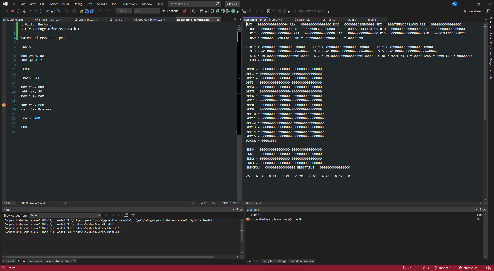

# Assignment - The First Program

The purpose of this assignment is to get a development environment up and running that can create and debug MASM programs.

## Prerequisites

- A computer running Windows 10 or Windows 11 64-bit on an x86-64 processor.
- Visual Studio 2017 or newer. You can download the latest Community edition for free [here](https://visualstudio.microsoft.com/downloads/).

## Instructions

A Visual Studio solution file (`assignment.sln`) is provided. Open the solution file with Visual Studio. Edit the assembly source file (`assignment.asm`) and paste the following assembly code into the file:

```
; << Replace this first line with your first and last name >>
; First Program for MASM 64-bit

extrn ExitProcess : proc

.DATA

num QWORD 80
sum QWORD ?

.CODE

_main PROC              ; Begin function - main entry point

    sub rsp, 28h        ; Bump 8 bytes to ensure 16 byte alignment. Reserve 32 bytes shadow space.

    mov rax, num
    add rax, 20
    mov sum, rax

    xor rcx, rcx        ; Clear RCX
    call ExitProcess    ; Use Windows API to exit the process

_main ENDP              ; End function

END
```

At the top of the file, edit the first comment line with your first and last name. For example:

```
; Victor Bushong
; First Program for MASM 64-bit
```

Place a breakpoint on the line `xor rcx, rcx`. Run the program until the breakpoint is hit.

When the program halts at the breakpoint, arrange Visual Studio's window frame to your preference. Open the registers debug window via the top menu: `Debug` -> `Windows` -> `Registers` ([example](./docs/debug-windows-menu.png)).

You can open other debug windows and arrange them. The following debug windows are recommended:
- Registers
- Memory (choose at least Memory 1, others are optional)
- Disassembly
- Autos

For this assignment, make sure both the assembly source code and the registers debug window are visible. The general purpose CPU registers (RAX, RBX, etc.) should be visible. If not, right-click within the registers debug window and check the `CPU` option. Any other options can be enabled at your preference.

Take a screenshot of Visual Studio while the program is paused at the breakpoint with the registers window in view. One way to capture the screenshot is to use the Windows Snipping Tool (shortcut `Windows` + `Shift` + `S`). An example screenshot is provided below. You do not have to match the example screenshot exactly, but the following requirements must be met:
  - The program is paused at a breakpoint at the line `xor rcx, rcx`.
  - The assembly source code is visible.
  - The general purpose CPU registers are visible.



Save your screenshot as `screenshot.png`. There is a placeholder file in this repository with the same name; replace this file with your screenshot.

Run the program to completion and verify the program does not crash.

## Submission

Commit and push the changes to your `main` branch in GitHub.

The following criteria must be satisfied:
- `assignment.asm` must be updated to include the assembly code provided above.
- `assignment.asm` must have a comment at the top of the file with your first and last name.
- `screenshot.png` must be replaced with your own screenshot as described above.
  - The program is paused at a breakpoint at the line `xor rcx, rcx`.
  - The assembly source code is visible.
  - The general purpose CPU registers are visible.

Note: there is a `.gitignore` file configured to ignore certain files, such as the binary and intermediate output files from your project (i.e., the `bin` or `obj` directories). Do not modify this. Best practice is to exclude generated binary output from version control.